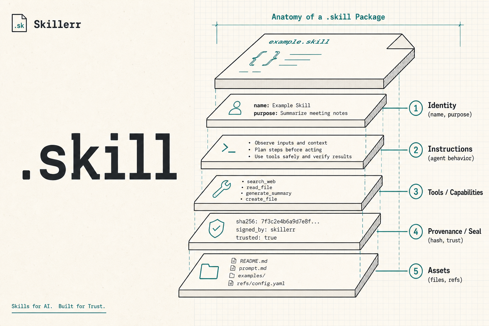

# Skillerr

<p align="center">
  
</p>

<p align="center">
  
</p>

<p align="center"><strong>Skillerr</strong></p>
<p align="center"><em>Sealed <code>.skill</code> packages for AI agents</em></p>

Open protocol and portable **`.skill`** format for AI skills — built so your **AI agent** can create, inspect, hand off, and run skills. You install once; then you talk to your AI.

**Site:** [skillerr.com](https://skillerr.com) · **Artifact:** `.skill` (sealed ZIP) · **Reference CLI:** [`skillerr`](https://www.npmjs.com/package/skillerr) (`skill`) · **Repo:** [dot-skill/skillerr](https://github.com/dot-skill/skillerr)

[](https://www.npmjs.com/package/skillerr)
[](./LICENSE)
[](https://nodejs.org)
[](./docs/PROTOCOL.md)

## Why this exists

Plain markdown “skills” and chat exports break down fast:

- Every model re-interprets free-form prose differently
- Context dies when you switch chats, tools, or hosts
- Workflows stay trapped in one product’s format
- There is no integrity story before something runs

**`.skill`** is a sealed, inspectable package: typed I/O, workflow, pinned knowledge, redacted provenance, digests, and optional mint. **Skillerr** is the project and docs behind it; install **`skillerr`** once (`npm i -g skillerr`) and point your agent at the work.

Markdown remains a **lossy adapter only** — not the protocol. See [docs/WHY.md](./docs/WHY.md).

---

## Install once

```bash
npm i -g skillerr
```

Node ≥ 20. One-shot: `npx -y skillerr --help`. After that, you do not drive a CLI checklist — you **point your AI at Skillerr**.

---

## Talk to your AI

Paste prompts like these into Cursor, ChatGPT, Claude, Codex, or any agent that can run shell tools. Your agent sets `SKILL_HOST` and runs the reference commands.

### Create a skill from this chat

```text
Install skillerr if needed (`npm i -g skillerr`). Set SKILL_HOST to your host id
(e.g. cursor). From this conversation, create a portable .skill: redacted journey,
exact sections I approved (secrets only as {{refs}}), then either checkpoint for
handoff or compile --approve --mint when release-complete. Do not invent filler.
Show me status and the output path.
```

### Inspect before you trust or run

```text
I have a file at ./file.skill. Inspect TrustView (digests, seals) without executing.
Validate integrity, then dry-run. Summarize what it does and any trust warnings.
Do not execute for real unless I explicitly ask.
```

### Extract multiple skills from a journey

```text
Using skillerr, run agent-guide then extract from ./journey.json into ./extraction.
For each candidate I select, open its own workspace, fill missing contract fields,
and only compile a release when complete — otherwise checkpoint. Prefer exact text.
```

### Load a continuity handoff

```text
Load ./handoff.skill as continuity context. Summarize intent, scrubbed journey,
open gaps, and pinned knowledge. Resume the work; do not mint a fake release.
```

### Hand off mid-work to another agent

```text
Checkpoint the current .skill workspace as a continuity draft (partial OK).
Tell me the output path and what the next agent should load.
```

More copy-paste prompts: [examples/prompts.md](./examples/prompts.md). Agent contract: [docs/AGENT.md](./docs/AGENT.md).

---

## What your agent will do

Commands below are what the **agent** runs — not a human homework list.

| Goal | What the agent runs |
|------|---------------------|
| Create workspace | `skill init` → `journey` → `propose` → `status` |
| Mid-work handoff | `skill checkpoint` |
| Release when complete | `skill compile -m "…" --approve --mint` |
| Trust before run | `skill inspect --trust` → `validate` → `run` (dry-run) |
| Resume handoff | `skill load ./file.skill` |

Creation requires a declared agent host (`SKILL_HOST=cursor|ollama|claude|…`). Humans review and approve releases. Declared host/model fields are self-reported provenance, not cryptographic proof of authorship.

---

## What good looks like

- **Inspect first** — digests and seals without executing (`skill inspect --trust`)
- **Validate** structure and hash integrity
- **Dry-run** before execute
- Continuity drafts may be incomplete; **release** compile refuses incomplete contracts (`compile_refused`)
- Reference mint HMAC in this repo is **development-only** — not production identity proof

See [docs/SECURITY.md](./docs/SECURITY.md).

| | Continuity draft | Release skill |
|---|---|---|
| Purpose | AI↔AI work handoff | Reusable sealed procedure |
| Incomplete? | Allowed (lists gaps) | **compile_refused** |
| Mint? | No | Yes |

---

## What’s in a `.skill`

```text
example.skill
├── skill.json           # manifest, digests, profile, completeness
├── workflow.json        # runnable steps
├── knowledge/           # pinned decisions / rules
├── provenance/          # redacted journey + generation_usage (tokens)
└── signatures/          # mint attestation (release)
```

---

## Status

Specification: Draft **0.5.0** ([docs/PROTOCOL.md](./docs/PROTOCOL.md))  
Reference CLI: `skillerr` @ **0.6.x**  
Independent conforming implementations welcome.

---

## Packages

| Package | Purpose |
|---------|---------|
| [`skillerr`](./packages/skillerr) | **Reference CLI** — bins `skill` / `skillerr` |
| [`@skillerr/cli`](./packages/cli) | CLI implementation |
| [`@skillerr/protocol`](./packages/protocol) | SkillContract, SkillSource, types |
| [`@skillerr/core`](./packages/core) | Compile, pack, validate, mint |
| [`@skillerr/runtime`](./packages/runtime) | Inspect / dry-run / execute |
| [`@skillerr/workspace`](./packages/workspace) | Local `.skill/` working tree |
| [`@skillerr/registry`](./packages/registry) | Optional local transparency log |

Host authors typically integrate the protocol libraries; end users install **`skillerr`** and talk to their agent.

---

## Documentation

- [Protocol](./docs/PROTOCOL.md) · [Agent](./docs/AGENT.md) · [Prompts](./examples/prompts.md)
- [Why structured packages](./docs/WHY.md) · [Continuity](./docs/CONTINUITY.md) · [Privacy](./docs/PRIVACY.md)
- [FAQ](./docs/FAQ.md) · [Security](./docs/SECURITY.md) · [Roadmap](./docs/ROADMAP.md)
- Site guides: [skillerr.com](https://skillerr.com)

---

## Contributing

Independent runtimes, language ports, adapters, and adversarial fixtures make this real.

- [CONTRIBUTING.md](./CONTRIBUTING.md) · [DCO.md](./DCO.md) (sign-off required)
- [GOVERNANCE.md](./GOVERNANCE.md) · [CODE_OF_CONDUCT.md](./CODE_OF_CONDUCT.md)

```bash
npm test
```

---

## License

[MIT](./LICENSE) — Copyright (c) 2026 Bharat Dudeja
